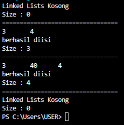
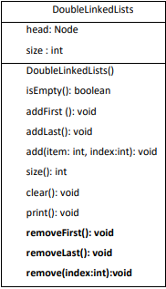
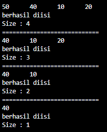
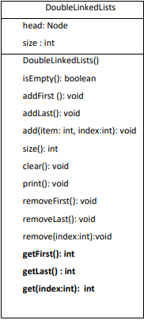

# LAPORAN JOBSHEET 12 PRAKTIKUM ALGORITMA DAN STRUKTUR DATA

Dibuat oleh : 

Yasmine Navisha Andhani 

1F D4 Teknik Informatika 

2141720047 

# 12.2 Kegiatan Praktikum 1 
## 12.2.1 Percobaan 1
1. Perhatikan diagram class Node dan class DoublelinkedLists di bawah ini! Diagram class ini yang selanjutnya akan dibuat sebagai acuan dalam membuat kode program DoubleLinkedLists. 

2. Buat paket baru dengan nama doublelinkedlists
3. Buat class di dalam paket tersebut dengan nama Node 

4. Di dalam class tersebut, deklarasikan atribut sesuai dengan diagram class di atas. 

5. Selanjutnya tambahkan konstruktor default pada class Node sesuai diagram di atas. 

6. Buatlah sebuah class baru bernama DoubleLinkedLists pada package yang sama dengan node seperti gambar berikut: 

7. Pada class DoubleLinkedLists tersebut, deklarasikan atribut sesuai dengan diagram class di atas. 

8. Selajuntnya, buat konstruktor pada class DoubleLinkedLists sesuai gambar berikut. 

9. Buat method isEmpty(). Method ini digunakan untuk memastikan kondisi linked list kosong. 

10. Kemudian, buat method addFirst(). Method ini akan menjalankan penambahan data di bagian depan linked list. 

11.  Selain itu pembuatan method addLast() akan menambahkan data pada bagian belakang linked list. 

12.  Untuk menambakan data pada posisi yang telah ditentukan dengan indeks, dapat dibuat dengan method add(int item, int index) 

13. Jumlah data yang ada di dalam linked lists akan diperbarui secara otomatis,sehingga dapat dibuat method size() untuk mendapatkan nilai dari size. 

14. Selanjutnya dibuat method clear() untuk menghapus semua isi linked lists, sehingga linked lists dalam kondisi kosong. 

15. Untuk mencetak isi dari linked lists dibuat method print(). Method ini akan mencetak isi linked lists berapapun size-nya. Jika kosong akan dimunculkan suatu pemberitahuan bahwa linked lists dalam kondisi kosong. 

16. Selanjutya dibuat class Main DoubleLinkedListsMain untuk mengeksekusi semua method yang ada pada class DoubleLinkedLists.

17. Pada main class pada langkah 16 di atas buatlah object dari class DoubleLinkedLists kemudian eksekusi potongan program berikut ini. 

## 12.2.2 Verifikasi Hasil Percobaan

## 12.2.3 Pertanyaan Percobaan
1. Jelaskan perbedaan antara single linked list dengan double linked lists!
> : Pada Single Linked Lists memiliki satu pointer yaitu pointer next dan satu arah, sedangkan Double Linked Lists memiliki 2 pointer, yaitu pointer next, prev dan memiliki dua arah.
2. Perhatikan class Node, didalamnya terdapat atribut next dan prev. Untuk apakah atribut tersebut?
> : Pointer next menunjuk pada node setelahnya dan pointer prev menunjukkan pada node sebelumnya.
3. Perhatikan konstruktor pada class DoubleLinkedLists. Apa kegunaan inisialisasi atribut head dan size seperti pada gambar berikut ini? 

> : Head digunakan menunjuk node pertama di dalam linked lists itu sendiri dan size digunakan untuk menentukan jumlah data yang ada di dalam linked lists dan akan diperbarui secara otomatis.
4. Pada method addFirst(), kenapa dalam pembuatan object dari konstruktor class Node prev dianggap sama dengan null? 

> : Karena saat penambahan data pada bagian sebelum head, data pada bagian head harus dipindahkan dulu ke dalam prev, sehingga inisialisasinya dianggap sama dengan null.
5. Perhatikan pada method addFirst(). Apakah arti statement head.prev = newNode ?
> : head.prev menunjuk ke input atau data yang ditambahkan.
6. Perhatikan isi method addLast(), apa arti dari pembuatan object Node dengan mengisikan parameter prev dengan current, dan next dengan null? 

> : Untuk penentuan node awal yaitu yang berisi current atau prev dan node akhir yang berisi null, kemudian node baru ditambahkan pada posisi lokasi next yang berisi null.

# 12.3 Kegiatan Praktikum 2
## 12.3.1 Tahapan Percobaan
 

1. Buatlah method removeFirst() di dalam class DoubleLinkedLists. 

2. Tambahkan method removeLast() di dalam class DoubleLinkedLists. 

3. Tambahkan pula method remove(int index) pada class DoubleLinkedLists dan amati hasilnya. 

4. Untuk mengeksekusi method yang baru saja dibuat, tambahkan potongan kode program berikut pada main class. 

## 12.3.2 Verifikasi Hasil Percobaan
 

## 12.3.3 Pertanyaan Percobaan
1. Apakah maksud statement berikut pada method removeFirst()?

> : head menunjukkan data yang berada di awal sehingga head menunjuk pada head.next kemudian head.next menunjuk head.prev menunjuk ke null dan head sama dengan null sehingga data awal terhapus.
2. Bagaimana cara mendeteksi posisi data ada pada bagian akhir pada method removeLast()?
> : Dengan menggunakan head = null atau current.next=null.
3. Jelaskan alasan potongan kode program di bawah ini tidak cocok untuk perintah remove! 

> : Dikarenakan tidak sesuai dengan indeks yang dipilih untuk dihapus.
4. Jelaskan fungsi kode program berikut ini pada fungsi remove! 

> : Menggabungkan bagian kosong di current yang dihapus.

# 12.4 Kegiatan Praktikum 3
## 12.4.1 Tahapan Percobaan
 

1. Buatlah method getFirst() di dalam class DoubleLinkedLists untuk mendapatkan data pada awal linked lists.

 

2. Selanjutnya, buatlah method getLast() untuk mendapat data pada akhir linked lists.

 

3. Method get(int index) di buat untuk mendapatkan data pada indeks tertentu.

 

4. Pada main class tambahkan potongan program berikut dan amati hasilnya! 

 

## 12.4.2 Verifikasi Hasil Percobaan
 

## 12.4.3 Pertanyaan Percobaan
1. Jelaskan method size() pada class DoubleLinkedLists!
> : Untuk menentukan jumlah data yang ada di dalam linked lists akan diperbarui secara otomatis, sehingga dapat dibuat method size() untuk mendapatkan nilai dari size.
2. Jelaskan cara mengatur indeks pada double linked lists supaya dapat dimulai dari indeks ke-1!
> : Dengan menggunakan method add() kemudian isi parameter method tersebut dengan data yang akan dimasukkan dan indeks 1, add(40,1).
3. Jelaskan perbedaan karakteristik fungsi Add pada Double Linked Lists dan Single Linked Lists! 
> : Dalam Single Linked List fungsi add dapat ditambahkan atau diinputkan data sesuai dengan indeks yang dipilih sedangkan pada Double Linked List fungsi add dapat ditambahkan datanya jika indeks berada atau sesuai dengan jumlah size nya. 
4. Jelaskan perbedaan logika dari kedua kode program di bawah ini! 

> : Pada method isEmpty yang (a) nilai kosong ditentukan dengan megecek atau membandingan nilai dari size jika nilai size sama dengan 0 maka true, sedangkan pada method isEmpty yang (b) nilai kosong ditentukan dengan megecek atau membandingan nilai dari head, jika head bernilai null maka true.

# 12.5 Tugas Praktikum
1. Buat program antrian vaksinasi menggunakan queue berbasis double linked list sesuai ilustrasi dan menu di bawah ini! (counter jumlah antrian tersisa di menu cetak(3) dan data orang yang telah divaksinasi di menu Hapus Data(2) harus ada) 

Ilustrasi Program 

Menu Awal dan Penambahan Data 

 

Cetak Data (Komponen di area merah harus ada) 

 

 

 

 

2. Buatlah program daftar film yang terdiri dari id, judul dan rating menggunakan double linked lists, bentuk program memiliki fitur pencarian melalui ID Film dan pengurutan Rating secara 
descending. Class Film wajib diimplementasikan dalam soal ini.

Contoh Ilustrasi Program 

 

 

 

 
